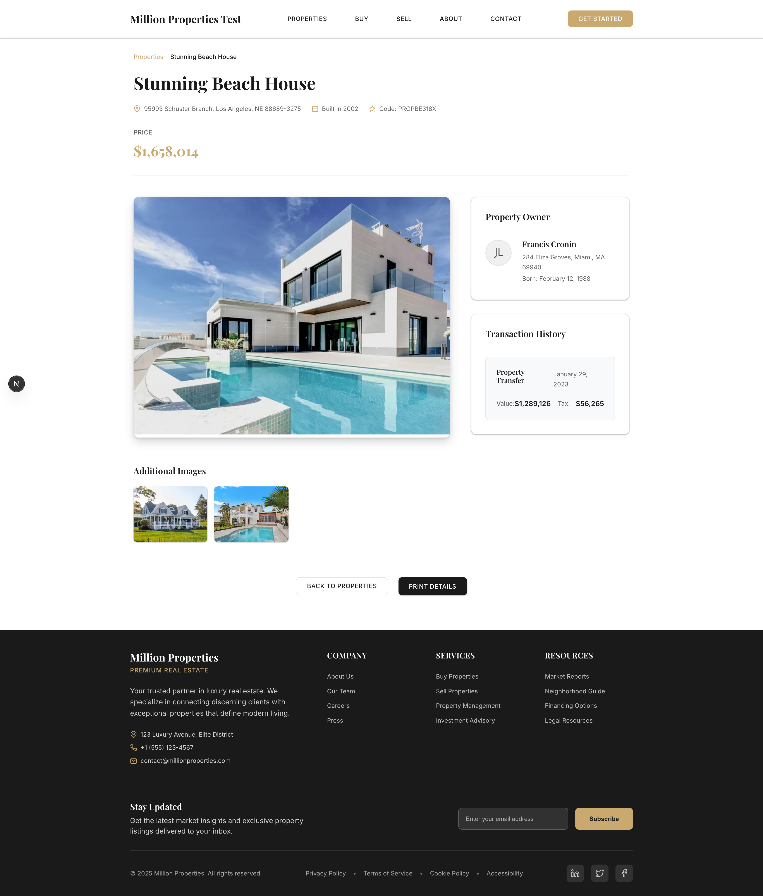

# Million Test Properties

A full-stack real estate application built with .NET Core 9, MongoDB, and Next.js. This application allows users to search, filter, and view property listings with detailed information.

## 📸 Screenshots

### Home Page - Property Search

*Premium luxury UI with glass morphism effects, advanced search filters, and responsive property grid*

### Property Detail View

*Detailed property information with image gallery, owner details, and transaction history*

## 🏗️ Architecture Overview

```
million-test/
├── backend/                 # .NET Core 9 Web API
│   └── MillionTestApi/     
│       ├── Controllers/     # API endpoints
│       ├── Models/          # MongoDB data models
│       ├── DTOs/            # Data transfer objects
│       ├── Services/        # Business logic layer
│       └── Tests/           # Unit tests (NUnit)
├── frontend/                # Next.js 15 React application
│   └── src/
│       ├── app/            # App router pages
│       ├── components/     # Reusable UI components
│       ├── services/       # API integration
│       └── types/          # TypeScript definitions
└── README.md
```

## 🚀 Features

### Backend API
- **RESTful API** with .NET Core 9
- **MongoDB integration** for data persistence
- **Advanced filtering** by name, address, and price range
- **Pagination** support for large datasets
- **Clean Architecture** with separation of concerns
- **Unit testing** with NUnit and Moq
- **Swagger documentation** for API endpoints
- **CORS configuration** for frontend integration

### Frontend Application
- **Next.js 15** with App Router and TypeScript
- **Premium Luxury UI Design** with dark theme and gold accents
- **Glass Morphism Effects** with backdrop blur and transparency
- **Advanced Property Search** with interactive filters and quick presets
- **Responsive Grid Layout** supporting up to 4 columns
- **Premium Property Cards** with hover animations and price categorization
- **Luxury Pagination** with progress indicators and smooth transitions
- **Professional Loading States** with shimmer effects
- **Image Optimization** with Next.js Image component
- **Mobile-First Responsive Design** optimized for all devices
- **Smooth Animations** and micro-interactions throughout

### Database Schema
- **Owner**: Property owner information
- **Property**: Real estate property data
- **PropertyImage**: Property photo management
- **PropertyTrace**: Sales transaction history

## 🛠️ Technology Stack

### Backend
- **.NET Core 9** - Web API framework
- **MongoDB** - Document database
- **C#** - Programming language
- **NUnit** - Unit testing framework
- **Moq** - Mocking framework
- **Swagger** - API documentation

### Frontend
- **Next.js 15** - React framework
- **React 18** - UI library
- **TypeScript** - Programming language
- **Tailwind CSS** - Utility-first CSS framework
- **ESLint** - Code linting

## 📋 Prerequisites

- [.NET Core 9 SDK](https://dotnet.microsoft.com/download)
- [Node.js 18+](https://nodejs.org/)
- [MongoDB Community Server](https://www.mongodb.com/try/download/community)
- [Git](https://git-scm.com/)

## 🐳 Docker Setup (Recommended)

The easiest way to run the project is using Docker Compose, which automatically sets up MongoDB, backend API, frontend, and data seeding.

### Option 1: Docker Compose (Full Stack)

```bash
# Clone the repository
git clone <repository-url>
cd million-test

# Start all services with Docker Compose
docker-compose up -d

# ✅ Backend API: http://localhost:5001
# ✅ Frontend App: http://localhost:3000  
# ✅ MongoDB: localhost:27017 (admin:million123)
# ✅ API Documentation: http://localhost:5001/swagger
# ✅ Automatic data seeding with 2,500+ properties
```

**What's included:**
- **MongoDB 7.0** with authentication and health checks
- **.NET Core 9 Backend** with production configuration
- **Next.js Frontend** with optimized build
- **Data Seeder** that automatically populates the database
- **Network isolation** and **volume persistence**

### Option 2: Docker with Local Development

```bash
# Start only MongoDB with Docker
docker run -d --name million-test-mongo \
  -p 27017:27017 \
  -e MONGO_INITDB_ROOT_USERNAME=admin \
  -e MONGO_INITDB_ROOT_PASSWORD=million123 \
  -v million-test-data:/data/db \
  mongo:7.0

# Then run backend and frontend locally
cd backend/MillionTestApi && dotnet run
cd frontend && npm run dev
```

### Docker Commands

```bash
# View running containers and their status
docker-compose ps

# View logs from all services
docker-compose logs -f

# View logs from specific service
docker-compose logs -f backend
docker-compose logs -f frontend
docker-compose logs -f mongodb

# Stop all services
docker-compose down

# Rebuild and restart (after code changes)
docker-compose up -d --build

# Clean up (removes containers and data)
docker-compose down -v

# Run only specific services
docker-compose up -d mongodb backend  # Just database and API
```

### Docker Health Checks

The setup includes health checks for all services:

```bash
# Check service health
docker-compose ps

# Manual health check
curl http://localhost:5001/health  # Backend
curl http://localhost:3000         # Frontend
```

## ⚡ Quick Start (5 minutes)

### Prerequisites Check
Make sure you have installed:
- [.NET Core 9 SDK](https://dotnet.microsoft.com/download) 
- [Node.js 18+](https://nodejs.org/)
- [MongoDB](https://www.mongodb.com/try/download/community) (running on localhost:27017)

### Option 1: Start Both Services (Recommended)

**Terminal 1 - Backend API:**
```bash
cd backend/MillionTestApi
dotnet run
# ✅ API running at http://localhost:5001
# ✅ Swagger docs at http://localhost:5001/swagger
```

**Terminal 2 - Frontend App:**
```bash
cd frontend  
npm install  # First time only
npm run dev
# ✅ Luxury UI running at http://localhost:3000
# ✅ Professional design ready for interview showcase
```

### Option 2: One-Step Setup Script

```bash
# Run this from the project root
./start.sh  # Creates this script below
```

### Option 3: Manual Setup

#### 1. Clone Repository
```bash
git clone <repository-url>
cd million-test
```

#### 2. Backend Setup
```bash
cd backend/MillionTestApi

# Install dependencies and run tests
dotnet restore
dotnet build  
dotnet test   # Should pass all 15 tests

# Start API server
dotnet run --urls="http://localhost:5001"
```

#### 3. Frontend Setup  
```bash
cd frontend

# Install dependencies
npm install

# Start development server
npm run dev
```

### 🌐 Access Points
- **Frontend**: http://localhost:3000
- **Backend API**: http://localhost:5001  
- **API Documentation**: http://localhost:5001/swagger
- **Health Check**: http://localhost:5001/api/properties

### 🧪 Verify Everything Works
```bash
# Test backend
curl http://localhost:5001/api/properties

# Test frontend (should show property search page)
open http://localhost:3000
```

### 🎲 Sample Data Generation

The application needs sample data to showcase its features. Generate realistic sample data:

```bash
# Generate 2,500 properties with owners, images, and transaction history
./seed-data.sh
```

This creates:
- **1,000 property owners** with realistic profiles
- **2,500 properties** with detailed information
- **8,600+ property images** from Unsplash
- **5,000+ transaction records** with pricing history

### 4. Setup MongoDB

1. Install and start MongoDB locally
2. The application will automatically connect to `mongodb://localhost:27017`
3. Databases used:
   - Production: `million_test`
   - Development: `million_test_dev`

## 📊 Database Collections

### owners
```javascript
{
  _id: ObjectId,
  idOwner: Number,
  name: String,
  address: String,
  photo: String,
  birthday: Date
}
```

### properties
```javascript
{
  _id: ObjectId,
  idProperty: Number,
  name: String,
  address: String,
  price: Number,
  codeInternal: String,
  year: Number,
  idOwner: Number
}
```

### property_images
```javascript
{
  _id: ObjectId,
  idPropertyImage: Number,
  idProperty: Number,
  file: String,
  enabled: Boolean
}
```

### property_traces
```javascript
{
  _id: ObjectId,
  idPropertyTrace: Number,
  dateSale: Date,
  name: String,
  value: Number,
  tax: Number,
  idProperty: Number
}
```

## 🔧 Configuration

### Backend Configuration
Edit `appsettings.json` and `appsettings.Development.json`:

```json
{
  "DatabaseSettings": {
    "ConnectionString": "mongodb://localhost:27017",
    "DatabaseName": "million_test"
  },
  "AllowedHosts": "localhost;127.0.0.1;*.milliontest.com"
}
```

### Frontend Configuration
Create `.env.local` in the frontend directory:

```env
NEXT_PUBLIC_API_URL=http://localhost:5001
```

## 🧪 Testing

### Backend Tests
```bash
cd backend/MillionTestApi
dotnet test --verbosity normal
```

### Frontend Tests (if implemented)
```bash
cd frontend
npm test
```

## 📝 API Endpoints

### Properties
- `GET /api/properties` - Get filtered properties list
  - Query parameters: `name`, `address`, `minPrice`, `maxPrice`, `page`, `pageSize`
- `GET /api/properties/{id}` - Get property details
- `POST /api/properties` - Create property
- `PUT /api/properties/{id}` - Update property
- `DELETE /api/properties/{id}` - Delete property

## 🎨 UI Components & Design System

### Main Components
- **PropertyFilter** - Advanced search with glass morphism, quick filters, and price formatting
- **PropertyList** - Responsive grid with staggered animations and luxury loading states
- **PropertyCard** - Premium cards with glass effects, price categorization, and hover animations
- **Pagination** - Luxury pagination with progress indicators and smooth transitions
- **PropertyDetail** - Detailed property view with image gallery (coming soon)

### Design System Features
- **Glass Morphism** - Backdrop blur effects with transparency layers
- **Luxury Color Palette** - Dark themes with gold/yellow accent gradients
- **Premium Typography** - Playfair Display for headings, Inter for body text
- **Smooth Animations** - Hover effects, scale transforms, and staggered loading
- **Responsive Grid** - Mobile-first design supporting 1-4 columns
- **Loading States** - Professional shimmer effects and luxury spinners
- **Interactive Elements** - Hover states, micro-interactions, and visual feedback

## 🔒 Security Features

- **CORS policy** configured for specific origins
- **Input validation** on all API endpoints
- **Error handling** with proper HTTP status codes
- **SQL injection prevention** through MongoDB's BSON
- **XSS protection** through React's built-in escaping

## 📈 Performance Optimizations

### Backend
- **Pagination** to handle large datasets
- **Indexed MongoDB queries** for faster searches
- **Async/await** patterns throughout
- **Connection pooling** via MongoDB driver

### Frontend
- **Server-side rendering** with Next.js
- **Image optimization** with Next.js Image component
- **Code splitting** automatic with Next.js
- **Caching strategies** for API responses

## 🐛 Error Handling

### Backend
- Global exception handling middleware
- Proper HTTP status codes
- Detailed error logging
- User-friendly error messages

### Frontend
- Try-catch blocks for API calls
- Loading states for better UX
- Error boundaries for React components
- Graceful degradation

## 🚀 Deployment

### Backend Deployment
1. Configure production MongoDB connection
2. Update CORS policy for production domain
3. Build for production: `dotnet publish -c Release`
4. Deploy to your preferred hosting service

### Frontend Deployment
1. Update `NEXT_PUBLIC_API_URL` for production
2. Build for production: `npm run build`
3. Deploy to Vercel, Netlify, or your preferred hosting service

## 🤝 Contributing

1. Fork the repository
2. Create a feature branch
3. Commit your changes
4. Push to the branch
5. Create a Pull Request

## 📄 License

This project is licensed under the MIT License.

## 👥 Team

Developed as part of the Million Test technical assessment.

---

For more detailed information, please refer to the individual README files in the `backend` and `frontend` directories.